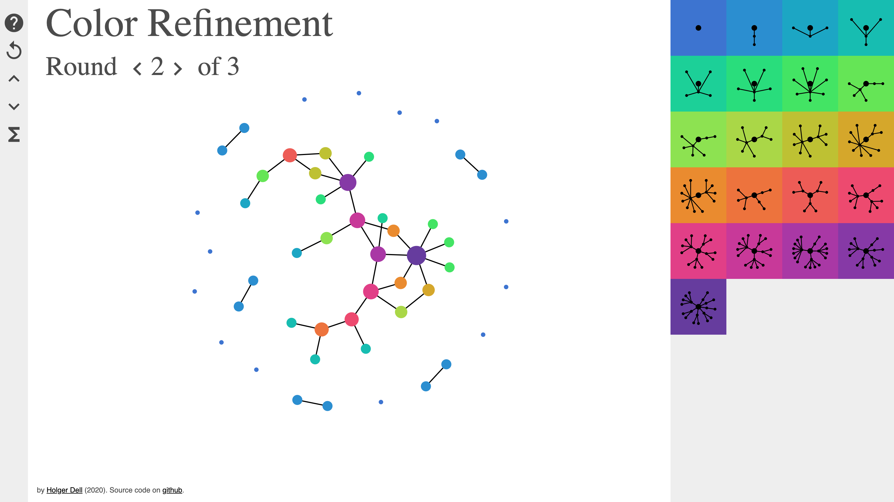

# Color Refinement

A visual demo of the color refinement algorithm.

- Use it [online](https://holgerdell.github.io/color-refinement/)
- For offline use, you will need to download the external resources loaded at the top of index.html, and change the paths correspondingly.

## Screenshot


## Description
The color refinement algorithm is a heuristic method to detect whether two graphs are isomorphic (see, e.g., [GKMS17+]).
It is also known as the 1-dimensional Weisfeiler-Leman algorithm.

## Development

Install the development tools:
```bash
yarn
```

Start an http server for local development:
```bash
yarn run http-server
```

Manually run the JavaScript linter [standard](https://standardjs.com/):
```bash
yarn run standard
```

Manually run the CSS linter [stylelint](https://stylelint.io/):
```bash
yarn run stylelint "**/*.css"
```

Both linters support `--fix` for automatic fixing.

Visual Studio Code provides the extensions [chenxsan.vscode-standardjs](https://marketplace.visualstudio.com/items?itemName=chenxsan.vscode-standardjs) and [stylelint.vscode-stylelint](https://marketplace.visualstudio.com/items?itemName=stylelint.vscode-stylelint) for automatic linting.

## Built with
- [D3.js](https://d3js.org/)
- [CSS grid](https://developer.mozilla.org/en-US/docs/Web/CSS/grid)
- [normalize.css](https://necolas.github.io/normalize.css/)

## References

[GKMS17+] Martin Grohe, Kristian Kersting, Martin Mladenov, and Pascal Schweitzer. Color Refinement and its Applications. In _An Introduction to Lifted Probabilistic Inference_. Cambridge
University Press. To appear. ([preprint url](https://www.lics.rwth-aachen.de/global/show_document.asp?id=aaaaaaaaabbtcqu))
